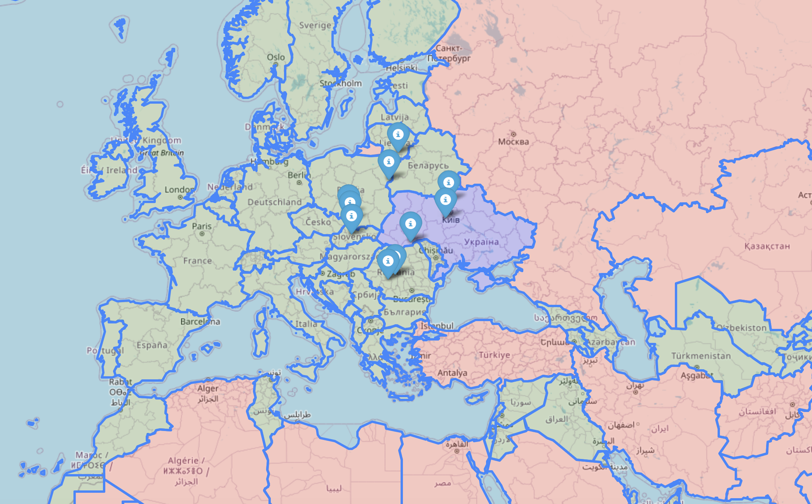

# Film_locations

Film_location is a project that generates a map of film sets closesest to the location, that user provides.

## Requirements

```bash
pip install pandas
pip install haversine
pip install argparse
pip install folium
```

## Usage

```bash
python3 main.py 2011 49.49 28 /Users/nazartkhir/Work/op/week21/film_locations/final_dataset.csv
```



## Conclusion

On the map we can see 10 closets film sets to given location.
Also, as a bonus, we can see countries that have larger area than Ukraine (red), smaller (green) and Ukraine itself (blue).
